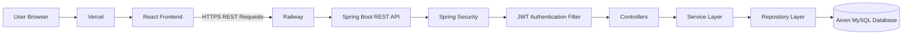
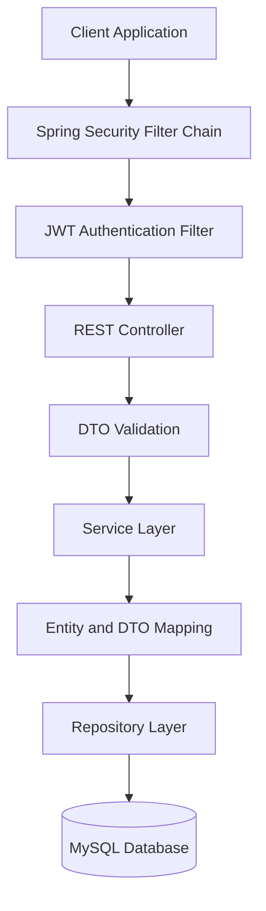
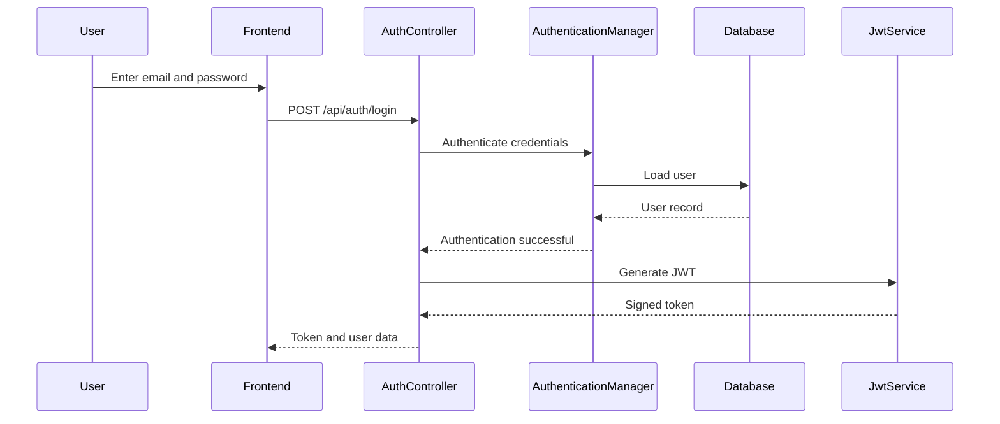
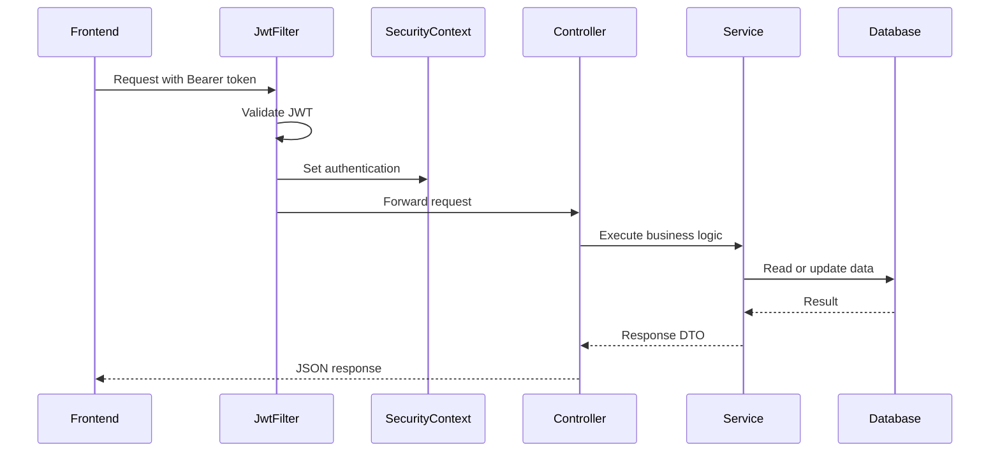
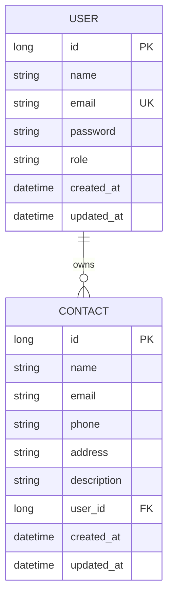
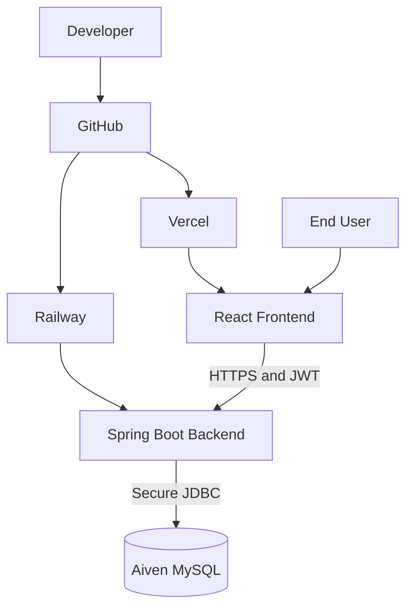

<div align="center">

# 📇 Contact Manager — Enterprise REST API

### Secure, Scalable & Production-Ready Contact Management Backend

[](https://www.java.com/)
[](https://spring.io/projects/spring-boot)
[](https://spring.io/projects/spring-security)
[](https://www.mysql.com/)
[](https://railway.app/)
[](https://vercel.com/)
[](https://junit.org/junit5/)
[](https://site.mockito.org/)
[](#-license)

<br />

A production-ready backend REST API built with **Java 17**, **Spring Boot 3**, **Spring Security**, **JWT**, **Spring Data JPA**, and **MySQL**.

The system follows a clean layered architecture and provides secure authentication, contact management, pagination, search, validation, centralized exception handling, logging, unit testing, and cloud deployment.

<br />

[🚀 Live Application](https://contact-manager-ui-alpha.vercel.app/contacts) •
[⚙️ Live Backend API](https://contact-manager-api-production-0aa6.up.railway.app) •
[💻 Frontend Repository](https://github.com/AkramSE/Contact-Manager-UI) •
[🐙 GitHub Profile](https://github.com/AkramSE)

</div>

---

## 📑 Table of Contents

- [Overview](#-overview)
- [Live Deployment](#-live-deployment)
- [Cloud Infrastructure](#️-cloud-infrastructure)
- [Features](#-features)
- [Technology Stack](#️-technology-stack)
- [System Architecture](#️-system-architecture)
- [JWT Authentication Flow](#-jwt-authentication-flow)
- [Project Structure](#-project-structure)
- [Database Design](#️-database-design)
- [Security](#-security)
- [API Endpoints](#-api-endpoints)
- [Validation](#-validation)
- [Exception Handling](#-exception-handling)
- [Logging](#-logging)
- [Testing](#-testing)
- [Local Development](#-local-development)
- [Environment Variables](#-environment-variables)
- [Cloud Deployment](#-cloud-deployment)
- [Roadmap](#️-roadmap)
- [Contributing](#-contributing)
- [License](#-license)
- [Author](#-author)

---

## 📌 Overview

**Contact Manager Enterprise REST API** is a secure backend application for managing authenticated users and their personal contacts.

It demonstrates modern backend development concepts, including:

- RESTful API design
- JWT-based authentication and authorization
- BCrypt password encryption
- DTO-based request and response handling
- Layered enterprise architecture
- Spring Data JPA and Hibernate persistence
- Bean Validation
- Global exception handling
- Pagination and search
- Structured application logging
- Unit testing with JUnit 5 and Mockito
- Production deployment using Railway and Aiven

This backend serves the React-based Contact Manager frontend.

### Frontend Application

- **Live Application:**  
  https://contact-manager-ui-alpha.vercel.app/contacts

- **Frontend Repository:**  
  https://github.com/AkramSE/Contact-Manager-UI

---

## 🚀 Live Deployment

| Service | Platform | Status | URL |
|---|---|---|---|
| Frontend | Vercel | 🟢 Live | [Open Application](https://contact-manager-ui-alpha.vercel.app/contacts) |
| Backend API | Railway | 🟢 Live | [Open Backend](https://contact-manager-api-production-0aa6.up.railway.app) |
| MySQL Database | Aiven Cloud | 🟢 Live | Private production database |

### Production URLs

```text
Frontend:
https://contact-manager-ui-alpha.vercel.app/contacts

Backend:
https://contact-manager-api-production-0aa6.up.railway.app
```

> The Aiven database is private and accessed securely through environment variables configured in Railway.

---

## ☁️ Cloud Infrastructure



| Platform | Responsibility |
|---|---|
| **Vercel** | Hosts and delivers the React frontend |
| **Railway** | Hosts the Spring Boot backend |
| **Aiven** | Hosts the production MySQL database |
| **GitHub** | Source control and repository hosting |
| **JWT** | Secures authenticated API requests |
| **HTTPS** | Encrypts frontend-to-backend communication |

---

## ✨ Features

### Authentication and Security

- Secure user registration
- Secure user login
- JWT token generation and validation
- Stateless authentication
- BCrypt password hashing
- Protected REST endpoints
- Spring Security filter chain
- Custom unauthorized-access handling
- CORS configuration
- Environment-based production secrets

### Contact Management

- Create contacts
- Retrieve contacts
- Retrieve a contact by ID
- Update contacts
- Delete contacts
- Search contacts
- Paginated contact retrieval
- User-specific contact ownership

### Architecture and Maintainability

- Layered architecture
- DTO pattern
- Dependency injection
- Separation of concerns
- Global exception handling
- Bean Validation
- Structured logging
- Unit testing with mocks
- Cloud-ready configuration

---

## 🛠️ Technology Stack

| Category | Technology |
|---|---|
| Language | Java 17 |
| Framework | Spring Boot 3.x |
| Security | Spring Security |
| Authentication | JSON Web Token |
| Password Encryption | BCrypt |
| Persistence | Spring Data JPA |
| ORM | Hibernate |
| Database | MySQL |
| Production Database | Aiven MySQL |
| Validation | Jakarta Bean Validation |
| Build Tool | Maven |
| Logging | SLF4J and Logback |
| Testing | JUnit 5 |
| Mocking | Mockito |
| Backend Deployment | Railway |
| Frontend Deployment | Vercel |
| API Style | REST |
| Data Format | JSON |

---

## 🏗️ System Architecture



### Layer Responsibilities

| Layer | Responsibility |
|---|---|
| Controller | Receives HTTP requests and returns responses |
| DTO | Controls API input and output |
| Service | Contains business logic |
| Repository | Performs database operations |
| Entity | Maps Java classes to database tables |
| Security | Authenticates users and protects endpoints |
| Exception | Provides centralized error handling |
| Configuration | Defines security, CORS, and application configuration |

---

## 🔐 JWT Authentication Flow



### Protected Request



### Authorization Header

```http
Authorization: Bearer <your-jwt-token>
```

---

## 📁 Project Structure

```text
Contact-Manager-API/
├── src/
│   ├── main/
│   │   ├── java/
│   │   │   └── com/
│   │   │       └── tenpearls/
│   │   │           └── contact_manager/
│   │   │               ├── config/
│   │   │               ├── controller/
│   │   │               ├── dto/
│   │   │               ├── entity/
│   │   │               ├── exception/
│   │   │               ├── repository/
│   │   │               ├── security/
│   │   │               ├── service/
│   │   │               └── ContactManagerApplication.java
│   │   └── resources/
│   │       ├── application.properties
│   │       ├── application-dev.properties
│   │       └── application-prod.properties
│   └── test/
│       └── java/
├── .gitignore
├── mvnw
├── mvnw.cmd
├── pom.xml
└── README.md
```

---

## 🗄️ Database Design



### Relationship

```text
One User can own many Contacts.

USER 1 ─────────────── N CONTACT
```

---

## 🛡️ Security

The application uses Spring Security with stateless JWT authentication.

### Security Controls

- Stateless session management
- JWT token verification
- BCrypt password encryption
- Protected contact endpoints
- Public authentication endpoints
- Authentication entry point
- Security context management
- CORS restrictions
- Contact ownership verification
- Environment-based secrets

### Public Endpoints

```text
POST /api/auth/register
POST /api/auth/login
```

### Protected Endpoints

```text
GET    /api/contacts
GET    /api/contacts/{id}
POST   /api/contacts
PUT    /api/contacts/{id}
DELETE /api/contacts/{id}
```

### Stateless Session Policy

```java
SessionCreationPolicy.STATELESS
```

---

## 🌐 API Endpoints

> Update endpoint paths if your actual controller mappings are different.

### Authentication API

| Method | Endpoint | Access | Description |
|---|---|---|---|
| `POST` | `/api/auth/register` | Public | Register a new user |
| `POST` | `/api/auth/login` | Public | Login and receive JWT |

### Contact API

| Method | Endpoint | Access | Description |
|---|---|---|---|
| `POST` | `/api/contacts` | Private | Create a contact |
| `GET` | `/api/contacts` | Private | Retrieve contacts |
| `GET` | `/api/contacts/{id}` | Private | Retrieve contact by ID |
| `PUT` | `/api/contacts/{id}` | Private | Update a contact |
| `DELETE` | `/api/contacts/{id}` | Private | Delete a contact |
| `GET` | `/api/contacts/search` | Private | Search contacts |

### Pagination Example

```http
GET /api/contacts?page=0&size=10&sort=name,asc
```

### Search Example

```http
GET /api/contacts/search?keyword=akram
```

---

## ✅ Validation

Common validation rules include:

- Name must not be blank
- Email must be valid
- Password must satisfy minimum-length requirements
- Required fields must not be null
- Duplicate email addresses are rejected
- Invalid contact IDs are handled safely

### Example DTO

```java
public class RegisterRequest {

    @NotBlank(message = "Name is required")
    private String name;

    @NotBlank(message = "Email is required")
    @Email(message = "Please provide a valid email address")
    private String email;

    @NotBlank(message = "Password is required")
    @Size(min = 8, message = "Password must contain at least 8 characters")
    private String password;
}
```

---

## ⚠️ Exception Handling

Centralized exception handling is implemented using `@RestControllerAdvice`.

### Handled Exceptions

- Resource not found
- Duplicate resource
- Invalid credentials
- Unauthorized access
- Validation failure
- Malformed requests
- Database errors
- Unexpected server errors

### Example Error Response

```json
{
  "timestamp": "2026-08-02T10:40:00",
  "status": 404,
  "error": "Resource Not Found",
  "message": "Contact not found with ID: 25",
  "path": "/api/contacts/25"
}
```

---

## 📜 Logging

The project uses SLF4J with Logback.

```java
private static final Logger log =
        LoggerFactory.getLogger(ContactServiceImpl.class);

log.info("Creating contact for user: {}", userEmail);
log.warn("Contact not found with ID: {}", contactId);
log.error("Unexpected error while creating contact", exception);
```

Sensitive information such as passwords, database credentials, and complete JWT tokens must never be logged.

---

## 🧪 Testing

The project uses JUnit 5 and Mockito.

### Test Coverage Areas

- Authentication business logic
- Contact CRUD operations
- Repository interactions
- Validation behavior
- Resource-not-found handling
- Duplicate-user handling
- Unauthorized-access scenarios

### Run Tests

```bash
./mvnw test
```

Windows:

```bash
mvnw.cmd test
```

Installed Maven:

```bash
mvn test
```

---

## 💻 Local Development

### Prerequisites

- Java 17+
- Maven 3.8+
- MySQL 8+
- Git
- IntelliJ IDEA, Eclipse, or VS Code
- Postman or another REST client

### Clone Repository

```bash
git clone https://github.com/AkramSE/Contact-Manager-API.git
cd Contact-Manager-API
```

### Create Database

```sql
CREATE DATABASE contact_manager_db;
```

---

## 🔧 Environment Variables

```env
DB_URL=jdbc:mysql://localhost:3306/contact_manager_db
DB_USERNAME=root
DB_PASSWORD=your_mysql_password
JWT_SECRET=your_secure_jwt_secret
JWT_EXPIRATION=86400000
FRONTEND_URL=http://localhost:5173
PORT=8080
```

### Example `application.properties`

```properties
spring.application.name=contact-manager

server.port=${PORT:8080}

spring.datasource.url=${DB_URL}
spring.datasource.username=${DB_USERNAME}
spring.datasource.password=${DB_PASSWORD}

spring.datasource.driver-class-name=com.mysql.cj.jdbc.Driver

spring.jpa.hibernate.ddl-auto=update
spring.jpa.show-sql=false
spring.jpa.properties.hibernate.format_sql=true

jwt.secret=${JWT_SECRET}
jwt.expiration=${JWT_EXPIRATION:86400000}

frontend.url=${FRONTEND_URL:http://localhost:5173}

logging.level.root=INFO
logging.level.com.tenpearls.contact_manager=DEBUG
```

### Never Commit

```text
Database passwords
JWT secrets
Aiven credentials
Railway environment variables
Private API keys
```

Add secret files to `.gitignore`:

```gitignore
.env
application-local.properties
application-secret.properties
```

---

## ▶️ Run the Application

Linux or macOS:

```bash
./mvnw clean install
./mvnw spring-boot:run
```

Windows:

```bash
mvnw.cmd clean install
mvnw.cmd spring-boot:run
```

Installed Maven:

```bash
mvn clean install
mvn spring-boot:run
```

### Local Base URL

```text
http://localhost:8080
```

---

## ☁️ Cloud Deployment



### Vercel Frontend

```text
https://contact-manager-ui-alpha.vercel.app/contacts
```

Example frontend environment variable:

```env
VITE_API_BASE_URL=https://contact-manager-api-production-0aa6.up.railway.app
```

### Railway Backend

```text
https://contact-manager-api-production-0aa6.up.railway.app
```

Recommended Railway variables:

```env
DB_URL=jdbc:mysql://your-aiven-host:your-port/defaultdb?ssl-mode=REQUIRED
DB_USERNAME=your_aiven_username
DB_PASSWORD=your_aiven_password
JWT_SECRET=your_production_jwt_secret
JWT_EXPIRATION=86400000
FRONTEND_URL=https://contact-manager-ui-alpha.vercel.app
PORT=8080
```

### Aiven MySQL

The production MySQL database is hosted privately on Aiven and connected to Railway using secured environment variables.

---

## 📤 API Examples

### Register

```bash
curl -X POST "http://localhost:8080/api/auth/register" \
  -H "Content-Type: application/json" \
  -d '{
    "name": "Muhammad Akram",
    "email": "akram@example.com",
    "password": "StrongPassword123"
  }'
```

### Login

```bash
curl -X POST "http://localhost:8080/api/auth/login" \
  -H "Content-Type: application/json" \
  -d '{
    "email": "akram@example.com",
    "password": "StrongPassword123"
  }'
```

### Create Contact

```bash
curl -X POST "http://localhost:8080/api/contacts" \
  -H "Content-Type: application/json" \
  -H "Authorization: Bearer YOUR_JWT_TOKEN" \
  -d '{
    "name": "Ali Khan",
    "email": "ali@example.com",
    "phone": "+92-300-1234567",
    "address": "Karachi, Pakistan",
    "description": "Professional contact"
  }'
```

### Get Contacts

```bash
curl -X GET "http://localhost:8080/api/contacts?page=0&size=10" \
  -H "Authorization: Bearer YOUR_JWT_TOKEN"
```

---

## 🧭 HTTP Status Codes

| Code | Meaning |
|---|---|
| `200 OK` | Request completed successfully |
| `201 Created` | Resource created successfully |
| `204 No Content` | Resource deleted successfully |
| `400 Bad Request` | Invalid input or validation error |
| `401 Unauthorized` | Authentication missing or invalid |
| `403 Forbidden` | Authenticated user lacks permission |
| `404 Not Found` | Resource not found |
| `409 Conflict` | Duplicate resource |
| `500 Internal Server Error` | Unexpected server error |

---

## 🗺️ Roadmap

- [ ] Refresh tokens
- [ ] Email verification
- [ ] Forgot-password flow
- [ ] Role-based access control
- [ ] Swagger/OpenAPI documentation
- [ ] Contact profile images
- [ ] Contact categories and favorites
- [ ] CSV import and export
- [ ] Docker support
- [ ] Redis caching
- [ ] Rate limiting
- [ ] Audit logging
- [ ] Integration tests
- [ ] GitHub Actions CI/CD
- [ ] Code coverage reporting
- [ ] Monitoring with Prometheus and Grafana

---

## 🤝 Contributing

1. Fork the repository.
2. Create a feature branch.
3. Make your changes.
4. Run the tests.
5. Commit using a descriptive message.
6. Push the branch.
7. Open a pull request.

```bash
git checkout -b feature/your-feature-name
git commit -m "feat: add your feature"
git push origin feature/your-feature-name
```

---

## 📄 License

This project is licensed under the MIT License.

```text
MIT License

Copyright (c) 2026 Muhammad Akram

Permission is hereby granted, free of charge, to any person obtaining a copy
of this software and associated documentation files, to deal in the Software
without restriction, including without limitation the rights to use, copy,
modify, merge, publish, distribute, sublicense, and sell copies of the
Software.
```

---

## 👨‍💻 Author

<div align="center">

### Muhammad Akram

**Software Engineering Student | Java & Spring Boot Backend Developer**

[](http
